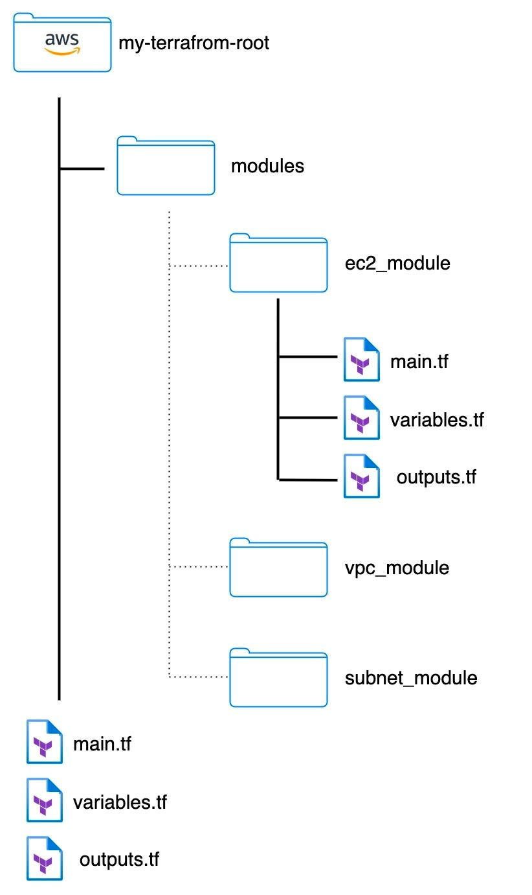

# Terraform Blocks

이번 장에서는 테라폼에 어떠한 블록이 있는지 살펴보고 **어떤 상황**에서 **어떤 블록**을 사용해야 하는지에 대해서 알아본다.

---

## Block Intro

- HCL(Hashicorp Configuration Language)는 **블록(Block)** 을 사용하여 리소스를 정의하며, 블록은 다른 콘텐츠의 컨테이너로 볼 수 있다.
- 블록에는 블록 본문을 포함하는 대괄호(`{}`)가 뒤에 오는 0개 이상의 필수 레이블을 가질 수 있는 유형(`type`)이 있다.
- 블록은 서로 중첩될 수 있으며 아래는 일반적인 블록의 표현이다.

```terraform
type "label_1" "label_2" {
  argument_1 = value_1
  argument_2 = value_2
}
```

- 아래는 대표적으로 많이 사용되는 `resource` 블록의 예시이다.

```terraform
resource "aws_instance" "my_instance" {
  ami           = "ami-blabla"
  instance_type = "t2.micro"

  tags = {
    Owner     = "MyTeam"
    CreatedBy = "Terraform"
  }
}
```

- `aws_instance`는 AWS 리소스 유형을 가리키는 첫 번째 레이블이고, `my_instance`는 리소스 이름을 나타내는 두 번째 레이블이다.
- 실제로 테라폼 코드에서 점(`.`) 표기법을 사용하여 리소스에 접근(예. `aws_instance.my_instance.tags`) 하기 때문에 사용자 정의라고 하더라도 두 번째 레이블도 중요하다.
- 첫 번째 레이블인 리소스 유형에 따라 필수 인수가 있을 수 있으므로 [공식문서](https://registry.terraform.io/providers/hashicorp/aws/latest/docs/resources/instance#argument-reference)를 확인하면서 개발을 진행해야 한다.
- 예시에서 사용된 `aws_instance`의 경우 `ami`와 `instance_type`은 필수 인수이므로 개발자는 해당 값을 반드시 입력해야 한다.
- `tags`의 경우 필수 인수는 아니지만 작성하여 리소스를 구분할 수 있도록 하는 것이 좋다.
  예시에서는 `Owner` 키를 사용하여 해당 리소스를 작성한 팀을 표시하고, `CreatedBy` 키를 사용하여 테라폼에 만들어진 리소스이므로 수동으로 수정하지 말라는 표시를 하고 있다.

---

## Block Type

### Terraform Block

- 테라폼 블록은 우리가 원하는 테라폼의 버전을 설정하는 데 사용된다.
- 내부에 `required_providers` 블록을 사용하여 필요한 공급자의 버전과 공급자를 다운로드해야 하는 위치를 포함할 수 있다.
- 테라폼은 기본적으로 로컬의 상태파일을 저장하지만 `backend` 블록을 지정하여 원격 저장소에 상태파일을 저장할 수 있다. 자세한 사항은 [공식문서](https://developer.hashicorp.com/terraform/language/settings/backends/configuration)를 참고한다.
- 테라폼 블록은 일반적으로 설정을 `terraform.tf`라고 하는 별도의 파일로 분리하여 넣는다.
- 아래는 대표적으로 사용되는 테라폼 블록의 예시이다. 

```terraform
terraform {
  required_providers {
    aws = {
      source  = "hashicorp/aws"
      version = "~> 2.0"
    }
  }
  required_version = ">= 1.0.1"
  
  backend "remote" {
    organization = "my_company"
    workspace {
      name = "my-workspace"
    }
  }
}
```

---

### Provider Block

- 공급자 블록은 테라폼이 다양한 클라우드 호스팅 플랫폼 또는 데이터 센터와 상호 작용할 수 있도록 하는 툭수 유형의 모듈을 지정한다.
- 공급자를 사용하려면 적절한 자격 증명을 통해서 인프라를 수정할 수 있는 권한을 획득할 수 있도록 구성해야 한다.
- 공급자의 버전 및 다운로드 위치는 `required_providers` 블록을 사용하여 테라폼 블록 내에도 작성할 수 있지만 따로 공급자 블록을 통해서 지정할 수도 있다.
- `v0.13` 이상 버전에서는 테라폼 블록에 `required_providers` 블록을 사용해야 하며 `version` 인수의 사용은 권장되지 않는다.(추후 삭제 예정)
- 아래는 AWS 및 Google 공급자의 버전을 지정하는 공급자 블록의 예시이다. 

```terraform
# AWS
provider "aws" {
  version = "~> 3.0"
  region  = "ap-northeast-2"
}
# Google
provider "google" {
  project = "my-project"
  region  = "us-central1"
}
```

- 클라우드가 여러 리전에 배포되어 있는 경우 여러 공급자를 사용해야하는 경우가 있을 수 있다. 
- 이러한 경우 `alias` 인수를 사용하여 여러 공급자를 구성할 수 있다.

```terraform
# The default provider configuration; resources that begin with `aws_` will use
# it as the default, and it can be referenced as `aws`.
provider "aws" {
  region = "us-east-1"
}

# Additional provider configuration for west coast region; resources can
# reference this as `aws.west`.
provider "aws" {
  alias  = "west"
  region = "us-west-2"
}
```

- 대체 공급자(예시에서는 `west`)를 사용하는 예시 코드는 아래와 같다.

```terraform
resource "aws_instance" "foo" {
  provider = aws.west
  # ...
}

module "aws_vpc" {
  providers = {
    aws = aws.west
  }
  # ...
}
```

---

### Resource Block

- 리소스 블록은 컴퓨팅 인스턴스, 가상 네트워크, 데이터베이스, 버킷 또는 DNS와 같은 리소스를 관리하는 데 사용된다.
- 리소스 블록은 대부분의 다른 블록 유형이 지원 역할을 하는 **실제 리소스를 나타내기 때문에** 모든 테라폼 구성에서 가장 중요한 역할을 한다.
- 테라폼의 기능을 최대한 활용할 수 있도록 해주는 [여러 표현식](https://developer.hashicorp.com/terraform/language/expressions)이 있으므로 공식문서를 참고하여 개발을 진행하는 것이 좋다.
- 아래는 AWS 인스턴스를 구성하는 리소스 블록의 예시이다.

```terraform
resource "aws_instance" "my_instance" {
  ami           = "ami-blabla"
  instance_type = "t2.micro"
  credit_specification {
    cpu_credits = "unlimited"
  }
}
```

#### Metadata Arguments

##### depends_on

- 테라폼이 자동으로 유추할 수 없는 숨겨진 리소스 또는 모듈 종속성을 처리하기 위해 사용된다.
- 리소스 또는 모듈이 다른 리소스의 동작에 의존하지만 해당 인수에서 해당 리소스의 데이터에 액세스하지 않는 경우 종속성을 명시적으로 지정하기만 하면 된다.
- `depends_on` 인수는 종속성을 선언하는 개체에 대한 작업을 수행하기 전에 종속성 개체에 대한 모든 작업(읽기 작업 포함)을 완료하도록 테라폼에게 지시한다.
- 종속 개체가 전체 모듈인 경우 테라폼이 해당 모듈과 연결된 모든 리소스 및 데이터 소스를 처리하는 순서에 영향을 준다.
- 종속성에 대한 자세한 내용은 [리소스 종속성](https://developer.hashicorp.com/terraform/language/resources/behavior#resource-dependencies)과 [데이터 리소스 종속성](https://developer.hashicorp.com/terraform/language/data-sources#data-resource-dependencies)에서 확인할 수 있다.
- 아래는 EC2 인스턴스에서 실행 중인 소프트웨어가 부팅하기 위해 S3 API에 액세스해야 하는 경우 `aws_iam_role_policy`에 숨겨진 종속성이 있기 때문에 `depends_on`을 통해 명시적으로 선언한 예시이다.
- `depends_on`은 특별한 경우에만 사용하기 때문에 개발자는 동료가 사용의 이유를 알 수 있도록 주석을 작성해야 한다.

```terraform
resource "aws_iam_role" "my_role" {
  name = "my_role"
  assume_role_policy = "blabla"
}

resource "aws_iam_instance_profile" "my_profile" {
  role = aws_iam_role.my_role.name
}

resource "aws_iam_role_policy" "my_role_policy" {
  name = "my_role_policy"
  role = aws_iam_role.my_role.name
  policy = jsonencode({
    "Statement" = [{
      "Action" = "s3:*",
      "Effect" = "Allow",
    }],
  })
}

resource "aws_instance" "my_instance" {
  ami                   = "ami-blabla"
  instance_type         = "t2.micro"
  iam_instance_profile  = aws_iam_instance_profile.my_profile
  
  # However, if software running in this EC2 instance needs access
  # to the S3 API in order to boot properly, there is also a "hidden"
  # dependency on the aws_iam_role_policy that Terraform cannot
  # automatically infer, so it must be declared explicitly:
  depends_on = [
    aws_iam_role_policy.my_role_policy
  ]
}
```

##### count

- 기본적으로 리소스 블록은 하나의 실제 인프라 개체를 구성한다.
- 만약 동일한 리소스 블록으로 여러 인프라 개체를 생성해야 한다면 `count`, `for_each` 블록을 사용할 수 있다.
- 다른 인수와 다르게 `count` 인수의 값은 테라폼이 원격 리소스 작업을 수행하기 전에 미리 정의되어 있어야 한다. 즉, 동적으로 변경될 수 없다는 것을 의미한다.
- 아래는 하나의 리소스 블록에서 4개의 동일(태그를 제외한)한 인스턴스를 생성하는 예시이다.

```terraform
resource "aws_instance" "my_instance" {
  count = 4
  ami = "ami_blabla"
  instance_type = "t2.micro"
  tags = {
    Name = "My Instance - ${count.index}"
  }
}
```

##### for_each

- `count`와 동일하게 하나의 리소스 블록에서 여러 인프라 개체를 생성하기 위해 사용된다.
- `for_each`는 Map 또는 문자열 집합을 허용하고 해당 맵 또는 집합의 각 항목에 대한 인스턴스를 생성한다.
- `for_each` 인수 또한 `count` 인수와 동일하게 테라폼이 원격 리소스 작업을 수행하기 전에 미리 정의되어 있어야 한다.

```terraform
# Map
resource "azurerm_resource_group" "resource_group" {
  for_each = {
    a_group = "asia"
    b_group = "america"
  }
  name      = each.key
  location  = each.value
}

# 문자열 세트
resource "aws_iam_user" "accounts" {
  for_each  = toset( ["Todd", "James", "Alice", "Dottie"] )
  name      = each.key
}

# 하위 모듈
module "bucket" {
  for_each  = toset(["assets", "media"])
  source    = "./publish_bucket"
  name      = "${each.key}_bucket"
}

variable "name" {}
resource "aws_s3_bucket" "my_bucket" {
  bucket = var.name
}
resource "aws_iam_user" "deploy_user" {}
```

- 아래는 `vpcs`라는 변수를 생성하고 여러 vpc 및 게이트웨이를 생성하는 예시이다.

```terraform
variable "vpcs" {
  type = map(object({
    cidr_block = string
  }))
}

resource "aws_vpc" "my_vpc" {
  for_each = var.vpcs
  cidr_block = each.value.cidr_block
}

resource "aws_internet_gateway" "my_gateway" {
  for_each  = aws_vpc.my_vpc
  vpc_id    = each.value.id
}

output "vpc_ids" {
  value = {
    for k, v in aws_vpc.my_vpc : k >= v.id
  }
  depends_on = [aws_internet_gateway.my_gateway]
}
```

##### provider

- 테라폼의 기본 동작을 재정의하여 리소스에 사용할 공급자 구성을 지정한다.
- 제공자 블록에서 살펴본 것과 같이 대체 공급자를 지정하는 것으로 이해하면 된다.

```terraform
provider "aws" {
  region = "ap-northeast-2"
}

provider "aws" {
  alias   = "northeast-1"
  region  = "ap-northeast-1"
}

resource "aws_instance" "my_instance" {
  provider = aws.northeast-1
}
```

##### lifecycle

- 리소스 블록 본문 내의 특수 중첩 블록을 사용하여 리소스의 수명 주기를 설정한다.
  
- `create_before_destroy`(boolean): 
  - 테라폼이 원격 API 제한으로 인해 내부에서 업데이트할 수 없는 리소스 인수를 변경해야 하는 경우 테라폼은 대신 기존 개체를 삭제한 다음 새로 구성된 인수로 새로운 대체 개체를 생성한다.
  - 이 값을 변경하여 새로운 대체 개체가 먼저 생성되고 이전 개체가 제거되도록 조절할 수 있다.
  - 기존 개체와 새로운 개체가 동시에 존재하기 위해 수용해야 하는 고유한 이름 요구 사항이나 기타 제약 조건이 있기 때문에 옵트인 동작이다.
  - 일부 리소스 유형은 충돌을 피하기 위해 각 개체 이름에 임의의 접미사를 추가하는 특수 옵션을 제공한다.
  - 이 값이 `true`로 설정된 경우 이 리소스의 피로비저너가 삭제되지 않는다.

- `prevent_destroy`(boolean):
  - 이 값을 `true`로 설정하면 이 인수가 구성에 남아있는 동안에는 테라폼이 이 리소스와 연결된 인프라 개체를 파괴하는 모든 계획을 오류와 함께 거부하게 된다.
  - 데이터베이스 인스턴스와 같이 재생산하는 데 많인 비용이 드는 개체의 경우 우발적인 교체에 대한 안전 조치로 사용할 수 있다.
  - 이 값을 `true`로 설정하는 경우 구성 변경 사항을 적용할 수 없게 만들고 개체가 생성된 후에는 `terraform destroy` 명령을 사용할 수 없게 되므로 사용이 권장되지 않는다.

- `ignore_changes`(속성 이름 목록):
  - 기본적으로 테라폼은 실제 인프라 개체의 현재 설정에서 차이를 감지하고 구성과 일치하도록 원격 개체를 업데이트할 계획을 만든다.
  - `ignore_changes` 기능은 미래에 변경될 수 있는 데이터에 대한 참조로 리소스를 생성할 때 사용하기 위한 것이지만 생성 후에는 해당 리소스에 영향을 미치지 않아야 한다.
  - 드물게 원격 개체의 속성이 테라폼 외부의 프로세스에 의해 수정되어 테라폼이 다음 실행에서 "수정"을 시도하게 되는데 이 값을 설정하여 해당 속성을 무시하도록 지정할 수 있다.

- `replace_triggered_by`(리소스 또는 속성 참조 목록):
  - 참조된 항목이 변경되면 리소스를 교체한다. 관리 자원, 인스턴스 또는 인스턴스 속성을 참조하는 표현식 목록을 사용할 수 있다.
  - `count` 또는 `for_each`를 사용하는 리소스에서 사용하는 경우 표현식에서 `count.index` 또는 `each.key`를 사용하여 동일한 개수 또는 컬렉션으로 구성된 다른 리소스의 특정 인스턴스를 참조할 수 있다.
  - 참조의 경우 아래의 조건에서 교체를 트리거 한다.
    - 여러 인스턴스가 있는 리소스에 대한 참조인 경우 인스턴스를 업데이트하거나 교체하려는 계획이 교체를 트리거한다.
    - 참조가 단일 리소스 인스턴스에 대한 것이라면 해당 인스턴스를 업데이트하거나 교체하려는 계획이 교체를 트리거한다.
    - 참조가 자원 인스턴스의 단일 속성에 대한 것이라면 속성 값이 변경되면 교체가 트리거된다.

- `precondition`, `postcondition`:
  - `lifecycle` 블록과 함께 `precondition`, `postcondition` 블록을 추가하여 리소스 및 데이터 원본이 작동하는 방식에 대한 가정 및 보장을 지정할 수 있다.
  - 아래의 예시는 선택된 AMI가 x86_64 기반의 CPU인지 검증하는 예시이다.

```terraform
resource "aws_instance" "my_instance" {
  instance_type = "t2.micro"
  ami           = "ami-blalba"

  lifecycle {
    # The AMI ID must refer to an AMI that contains an operating system
    # for the `x86_64` architecture.
    precondition {
      condition     = data.aws_ami.my_ami.architecture == "x86_64"
      error_message = "The selected AMI must be for the x86_64 architecture."
    }
  }
}
```

---

### Variable Block

- 변수 블록은 테라폼 모듈에 대한 매개변수를 제공하고 사용자가 소스를 수정하지 않고 다른 테라폼 모듈에 제공된 데이터를 사용자 정의할 수 있도록 한다.
- 일반적으로 `variables.tf` 파일에 정리되며 각각의 변수마다 하나의 블록이 생성된다.
- 아래는 일반적인 변수 블록의 예시이다.

```terraform
variable "my_variable" {
  type        = string
  description = "Description of my variable"
  default     = "Default value of my variable"
  sensitive   = true
}

variable "my_docker_ports" {
  type = list(object({
    internal = number
    external = number
    protocol = string
  }))
  default = [
    {
      internal = 8080
      external = 8080
      protocol = "tcp"
    }
  ]
}
```

- 테라폼에는 변수 설정에 대해 아래와 같은 우선순위가 있으며, 숫자가 낮을수록 높은 우선순위를 가진다.
  1. 명령줄(`-var` 및 `var-file`)
  2. `*.auto.tfvars` 또는 `*auto.tfvars.json`
  3. `terraform.tfvars.json`
  4. `terraform.tfvars` 파일
  5. 환경 변수
  6. 변수 기본값

- 변수 설정에는 아래와 같은 선택적 인수를 정의할 수 있다.
  - `default`: 변수를 선택 사항으로 만들 수 있으며 변수가 지정되지 않는 경우 기본값이 사용된다.
  - `type`: 변수에 허용되는 값의 유형을 지정한다. 설정되지 않는 경우 모든 유형의 값이 설정될 수 있으며 해당 인수를 통해 값을 제약하는 것이 권장된다.
  - `description`: 입력 변수를 문서화한다.
  - `validation`: 일반적으로 형식 제약 조건 외에 유효성 검사 규칙을 정의한다.
  - `sensitive`: 변수가 구성에 사용될 때 테라폼 UI 출력 제한 여부를 지정한다.
  - `nullable`: 변수가 `null`을 허용할 것인지 여부를 지정한다.

---

### Locals Block

- 로컬 블록은 클린 코드를 유지하기 위해 자주 참조되는 값이나 표현식을 유지하는 데 사용된다. 
  예를 들어, 동일한 코드내에서 여러 번 표현식을 반복하는 대신 로컬 블록에 표현식을 한 번 사용하여 변수에 값을 할당하고 동일 코드의 여러 곳에서 재사용하는 방식으로 사용한다.
- 로컬 블록은 내부에 많은 변수를 담을 수 있으며, 로컬 값의 표현식은 리터럴 상수로 제한되지 않는다.
- 모듈의 다른 값을 참조하여 변환하거나 결합할 수 있으며 `local.var_name`과 같은 표기법을 사용하여 액세스할 수 있다.

```terraform
locals {
  service_name = "my_service"
  owner        = "my_team"
  instance_ids = ["my_instance_1", "my_instance_2"]
}
```

- 로컬 값은 클린 코드를 유지하는 데 도움을 주지만 과도하게 사용하게되면 사용된 실제 값을 숨겨 미래에 유지 관리자가 구성을 이해하는 데 어려움을 줄 수 있다.
- 단일 값이나 결과가 여러 곳에서 사용되고 해당 값이 향후 변경될 가능성이 있는 상황에서 로컬 값을 적당히 사용해야 한다.
- **중앙 위치에서 여러 곳의 값을 변경할 수 있는 기능**이 로컬 값의 주요 이점이다.

---

### Data Blocks

- 데이터 블록의 주요 목적은 테라폼 이외의 API에서 데이터를 로드하거나 쿼리하는 것이다. 
  예를 들어, 프로바이더에서 제공하는 리소스 정보를 가져와서 테라폼에서 사용할 수 있는 형태로 매핑시킬 수 있다.
- 데이터 소스는 `data` 블록을 사용하여 선언된 데이터 리소스로 알려진 특별한 종류의 리소스를 통해 액세스된다.

```terraform
data "aws_ami" "my_ami" {
  most_recent = true
  owners = [ "self" ]
  tags = {
    Name    = "my-server"
    Tested  = "true"
  }
}
```

- 예시를 살펴보면 테라폼이 지정된 데이터 소스(`aws_ami`)를 읽고 지정된 로컬 이름(`my_ami`)으로 결과를 내보낼 것을 요청하는 것을 확인할 수 있다.
- 여기서 로컬 이름은 동일한 테라폼 모듈의 다른 위치에서 이 리소스를 참조하는 데 사용되지만 모듈 범위 밖에서는 의미가 없다. 이러한 이유로 데이터 소스와 이름은 동일 모듈 내에서 고유해야 한다.
- `tags`의 정보를 기반으로 이름이 `my-server`, Tested 값이 `true`인 AMI 정보를 가져오는 것을 확인할 수 있다.

#### Data vs Resource

- 데이터 리소스와 구별할 때 리소스의 기본 종류(`resource` 블록에 의해 선언됨)를 관리 리소스라고 한다.
- 두 종류의 리소스 모두 구성에 사용하기 위해 인수 및 내보내기 속성을 사용하지만 관리형 리소스로 인해 테라폼이 인프라 개체를 생성 업데이트하는 반면 데이터 리소스는 테라폼이 개체를 읽기만 하도록 한다.
- 간결하게 하기 위해 관리되는 리소스는 컨텍스트에서 의미가 명확한 경우 `resources`라고 한다.
- 정리하면, 데이터 블록은 읽기전용으로 리소스는 CRUD용으로 사용하면 된다.

---

### Module Block

- 모듈은 함께 사용되는 여러 리소스의 컨테이너이며, 디렉토리에 저장된 `.tf` 또는 `.tf.json` 파일로 구성된다.
- 모듈은 테라폼에서 리소스를 패키징하고 재사용하는 기본 방법이다.
- 모든 테라폼 구성에는 `.tf`파일에 정의된 리소스가 포함된 모델(루트 모듈)이 하나 이상 존재한다.
- 모듈은 여러 구성에서 재사용 가능한 리소스 모음의 구역을 나누는 좋은 방법이며, 아래는 모듈의 예시이다.



```terraform
module "consul" {
  source  = "hashicorp/consul/aws"
  version = "0.0.5"
  servers = 3
}
```

- 모듈을 호출한다는 것은 해당 모듈의 내용을 입력 변수에 대한 특정 값과 함께 구성에 포함시키는 것을 의미한다.
- 모듈은 `module` 블록을 사용하여 다른 모듈 내에서 호출된다.

#### source

- 모든 모듈에는 테라폼에서 정의한 메타 인수인 `source` 인수가 필요하다.
- 해당 값은 모듈의 구성 파일이 포함된 로컬 경로이거나 테라폼이 다운로드하여 사용해야 하는 원격 모듈 소스다. 
  깃허브와 같은 원격 저장소도 사용할 수 있으며 자세한 내용은 [공식문서](https://developer.hashicorp.com/terraform/language/modules/sources)를 참고한다.
- 모듈 블록이 수정된 경우 재시작해야 하는데 `terraform init` 명령만으로는 이미 설치된 모듈을 업그레이드하지 않기 때문에 `-upgrade` 옵션을 추가해야 한다.

#### version

- 원하는 모듈의 버전을 지정하며, 설치된 모듈이 예기치 않게 변경되는 것을 방지하기 위해 버전 번호를 명시적으로 제한하는 것이 권장된다.
- [버전 제한 문자열](https://developer.hashicorp.com/terraform/language/expressions/version-constraints)을 허용하며 테라폼은 제약 조건을 충족하는 최신 설치 모듈을 사용하며, 모듈이 설치되어 있지 않은 경우 조건을 충족하는 최신 버전을 다운로드한다.
- 버전 제약 조건은 "테라폼 레지스트리"와 "테라폼 클라우드의 개인 모듈 레지스트리"와 같은 모듈 레지스트리에서 설치된 모듈에 대해서만 지원되고 자체적으로 관리하는 모듈에 대해서는 작동하지 않는다.

---

### Outputs Block

- `main.tf`, `variables.tf`와 함께 대부분의 구성에 `outputs.tf` 파일로 존재하는 블록이다.
- 이를 통해 테라폼은 구성에 대한 구조화된 데이터를 출력할 수 있고, 출력을 사용하여 IP 또는 리소스 이름과 같은 데이터를 한 곳에서 편리하게 볼 수 있다.
- 테라폼 작업 공간에서 이 데이터를 사용하거나 모듈 간에 데이터를 공유하는 용도로도 사용된다.

```terraform
output "my_server_public_ip" {
  description = "My server output for public ip"
  value       = aws_instance.my_server.public_ip
  sensitive   = true
}

output "public_url" {
  description = "Public URL for my server"
  value       = "https://${aws_instance.my_server.public_ip}:8080/index.html"
}
```

- 하위 모듈은 출력을 사용하여 리소스 속성의 하위 집합을 상위 모듈에 노출할 수 있다.
- 루트 모듈은 출력을 사용하여 `terraform apply` 실행 후 CLI 출력에 특정 값을 출력할 수 있다.
- 원격 상태(remote state)를 사용하는 경우 루트 모듈 출력은 `terraform_remote_state` 데이터 소스를 통해 다른 구성에서 액세스할 수 있다.

#### 출력값 선언

- 모듈에서 내보낸 각 출력 값은 `output` 블록을 사용해서 선언해야 한다.

```terraform
output "instance_ip_address" {
  value = aws_instance.server.private_ip
}
```

- `output` 키워드 바로 뒤의 레이블인 이름은 유효한 식별자여야 한다.
- 루트 모듈에서 이 이름은 사용자에게 표시되고, 하위 모듈에서는 출력 값에 액세스하는 데 사용할 수 있다.
- `value` 인수는 결과를 사용자에게 반환할 표현식을 취한다.

#### 하위 모듈 출력에 액세스

- 상위 모듈에서 하위 모듈의 출력은 `module.<MODULE NAME>.<OUTPUT NAME>`과 같은 표현식으로 사용할 수 있다.
  예를 들어, 이름이 `web_server`라느 ㄴ하위 모듈이 `instance_ip_addr`이라는 출력을 선언한 경우, 우리는 `module.web_server.instance_ip_addr`과 같은 방식으로 접근할 수 있다.

---

### Provisioner Block

- 제공자(provisioner) 블록을 사용하면 서비스를 위한 리소스를 준비하기 위해 로컬 또는 원격 시스템에서 수행할 작업을 지정할 수 있다.
- 테라폼 제공자에는 `local-exec`와 `remote-exec` 두 가지 유형이 있다.
  - `local-exec`: 리소스가 생성된 후 로컬 실행 파일을 호출한다. 테라폼을 실행하는 머신에서 프로세스가 실행되며 이것은 `terraform apply`를 실행하는 머신을 의미한다.
  - `remote-exec`: AWS EC2 인스턴스와 같은 원격 실행 파일을 호출한다.
- 아래의 예시는 EC2 인스턴스에 대한 제공자 예시이며, `local-exec`와 `remote-exec`가 모두 포함되어 있다.

```terraform
resource "aws_instance" "web_server" {
  # ...
  provisioner "local-exec" {
    command = "Get-Date > completed.txt"
    interpreter = ["PowerShell", "-Command"]
  }
  provisioner "remote-exec" {
    inline = [
      "chmod +x /tmp/script.sh",
      "/tmp/script.sh args",
    ]
  }
}
```

- 제공자 블록은 선언적으로 정의할 수 없는 행위를 포함하고 대부분의 상황에서 더 나은 대안이 있기 때문에 최후의 수단으로 사용해야 하며, 사용이 권장되지 않는다.
- 아래는 몇 가지 제공자 사용 예시다.

```terraform
resource "aws_instance" "my_instance" {
  // 인스턴스가 실행되면 인스턴스의 내부 IP를 출력한다. 여기서 "self"는 자기 자신을 가리킨다.
  provisioner "local-exec" {
    command = "echo The server's IP address is ${self.private_ip}"
  }
}

resource "aws_instance" "my_instance" {
  // 인스턴스가 종료될 때 실행된다.
  provisioner "local-exec" {
    when = destroy
    command = "echo Destroy my instance"
  }
}

// SSH 접속하여 원격지에 있는 파일을 복사한다. 
provisioner "file" {
  source      = "conf/myapp.conf"
  destination = "/etc/myapp.conf"
  connection {
    type      = "ssh"
    user      = "root"
    password  = "${var.root_password}"
    host      = "${var.host}"
  }
}
```

---

### 참고한 자료

- [Terraform:HCL(HashiCorp 구성 언어) 블록](https://dev.to/af/hashicorp-configuration-language-hcl-blocks-5627)
- [Terraform Settings](https://developer.hashicorp.com/terraform/language/settings)
- [Provider Configuration](https://developer.hashicorp.com/terraform/language/providers/configuration)
- [Terraform Expressions](https://developer.hashicorp.com/terraform/language/expressions)
- [Resource Dependencies](https://developer.hashicorp.com/terraform/language/resources/behavior#resource-dependencies)
- [Data Resource Dependencies](https://developer.hashicorp.com/terraform/language/data-sources#data-resource-dependencies)
- [depends_on](https://developer.hashicorp.com/terraform/language/meta-arguments/depends_on)
- [count](https://developer.hashicorp.com/terraform/language/meta-arguments/count)
- [for_each](https://developer.hashicorp.com/terraform/language/meta-arguments/for_each)
- [Input variables](https://developer.hashicorp.com/terraform/language/values/variables)
- [Local Values](https://developer.hashicorp.com/terraform/language/values/locals)
- [Data Sources](https://developer.hashicorp.com/terraform/language/data-sources)
- [Module](https://developer.hashicorp.com/terraform/language/modules/syntax)
- [Module Sources](https://developer.hashicorp.com/terraform/language/modules/sources)
- [Version Constraints](https://developer.hashicorp.com/terraform/language/expressions/version-constraints)
- [Output Values](https://developer.hashicorp.com/terraform/language/values/outputs)
- [Provisioners](https://developer.hashicorp.com/terraform/language/resources/provisioners/syntax)